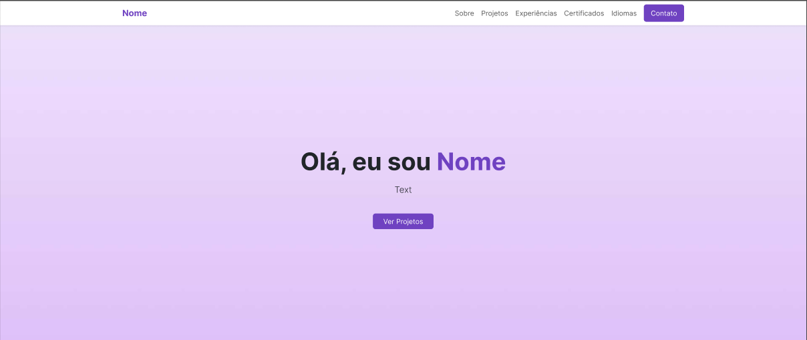
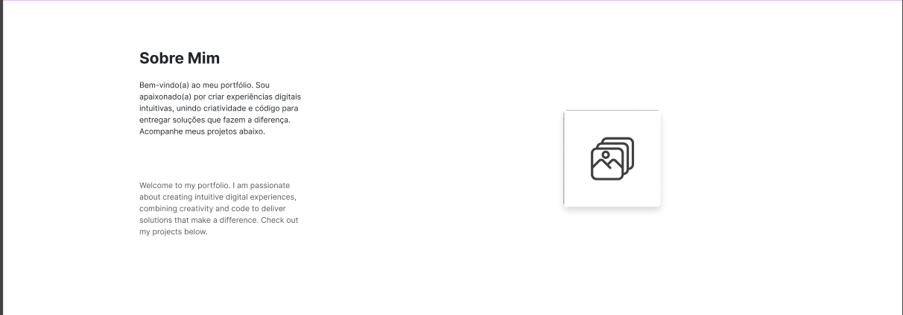
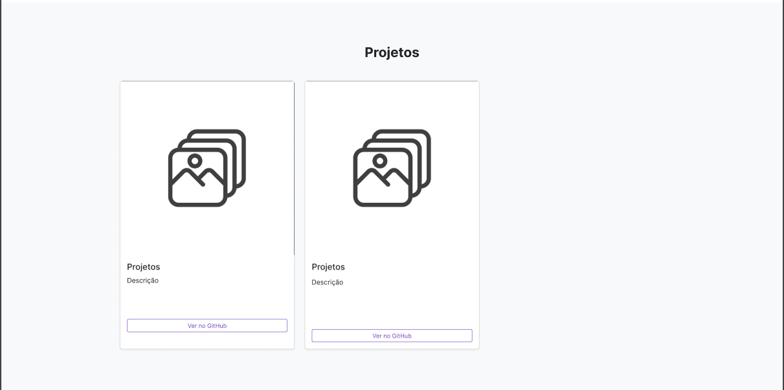
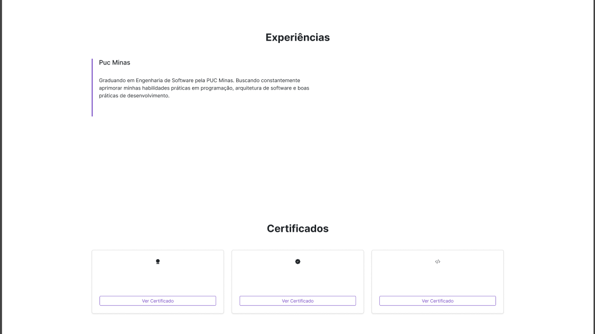
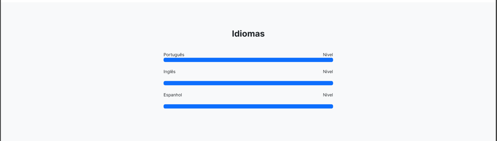
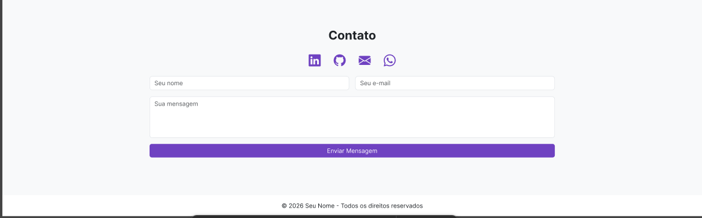

# Heleno Junior - Portfólio

Este é um projeto de portfólio pessoal desenvolvido para apresentar minhas experiências, projetos e habilidades como desenvolvedor.

## 🔗 Link do Repositório

O código fonte deste projeto pode ser acessado no GitHub:

[Portfólio Profissional - Heleno Junior](https://github.com/HelenoJuniorFernandes/Portfo-lio-Profissional-Heleno)

## 🚀 Tecnologias Utilizadas

Este projeto foi construído utilizando as seguintes tecnologias:

* **HTML5** – Estrutura semântica da página.
* **CSS3** – Estilização e layout do site.
* **Bootstrap 5** – Framework utilizado para responsividade e componentes prontos.

## 📚 Dependências e Bibliotecas

As principais bibliotecas utilizadas neste projeto incluem:

* **Bootstrap (via CDN)** – Interface responsiva e moderna.
* **Bootstrap Icons** – Ícones para redes sociais e elementos da interface.
* **Google Fonts** – Fonte "Inter" utilizada na tipografia.

## 📂 Estrutura do Projeto

A estrutura de diretórios está organizada da seguinte forma:

```
Portfo-lio-Profissional-Heleno/
├── lab_proj/
│   ├── assets/
│   │   └── img/
│   ├── css/
│   │   └── style.css
│   └── index.html
└── README.md
```

## ▶️ Como Executar o Projeto

Este é um projeto web estático, portanto não necessita de configuração complexa.

### 1. Clone o repositório

```bash
git clone https://github.com/HelenoJuniorFernandes/Portfo-lio-Profissional-Heleno.git
cd Portfo-lio-Profissional-Heleno
```

### 2. Execute o projeto

Abra o arquivo `index.html` localizado dentro da pasta `lab_proj/` diretamente no navegador.

### Alternativa (VS Code)

Caso utilize **Visual Studio Code**, você pode usar a extensão **Live Server** para rodar o projeto localmente.

## 🎨 Protótipo no Figma

O design do projeto pode ser visualizado no Figma:

https://www.figma.com/design/SW509218LvQkS5taqeN3Cy/Portfolio?node-id=1-2&t=mrNCcNjGCVSobvMt-1

## 📸 Telas do Projeto

### Página Inicial



### Sobre Mim



### Projetos



### Experiências e Certificados



### Idiomas



### Contato


